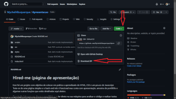

# Hired-me (página de apresentação)

Esse foi um projeto com objetivo de colocar em prática o aprendizado de HTML, CSS e um pouco de Javascript. 
Trata-se de uma página simples e o back-end não é funcional mas conta com apresentação, amostra de portifólio e algumas outras funções que estão detalhadas aqui abaixo.

Caso tenha interesse em clonar o repositório e rodar direto na sua máquina para analisar o código e realizar testes pode seguir esse passo a passo:

1 - Na página principal do repositório clique no botão verde "code", em seguida utilize a opção "Download ZIP" 
2 - Após extrair os arquivos, você pode abrir o arquivo "index.html" direto no seu navegador. 

  

